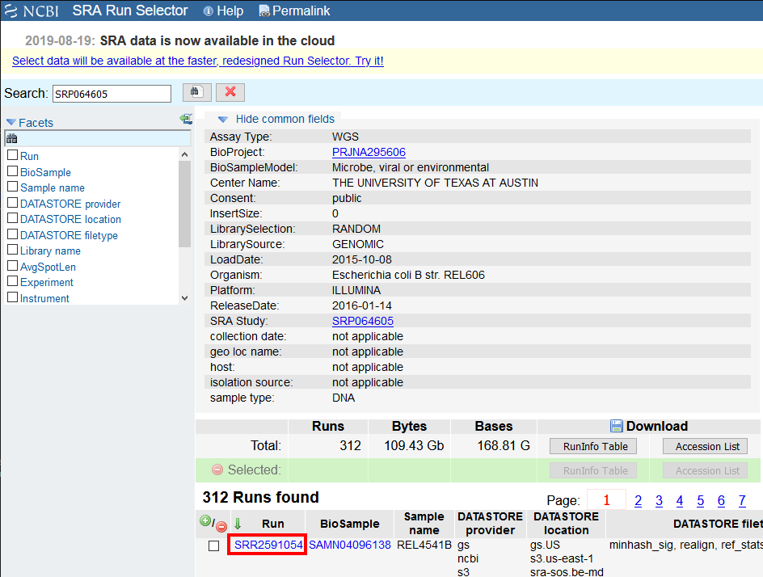
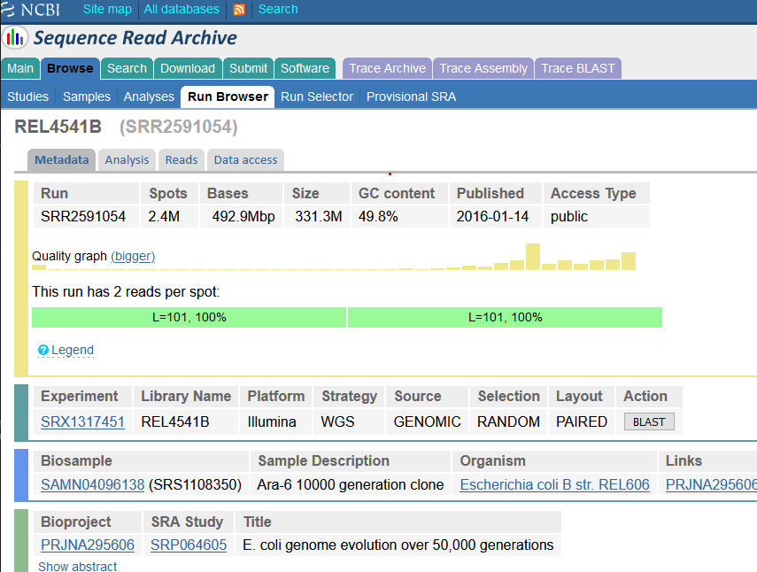
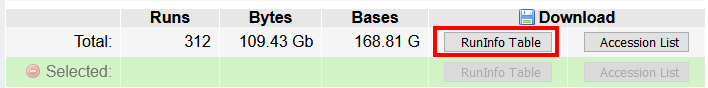

## Original (older) NCBI instructions

These will be phased out of our lesson when NCBI stops supporting
the old page versions.

1. Access the Tenaillon dataset from the provided link: [https://trace.ncbi.nlm.nih.gov/Traces/study/?acc=SRP064605](https://trace.ncbi.nlm.nih.gov/Traces/study/?acc=SRP064605). Click on "Revert to the old Run Selector" at the top of the page. 

2. You will be presented with the old page for the overall SRA accession SRP064605 - this is a collection of all the experimental data.

3. In this window, you will click on the Run Number of the first entry in the “Runs Found” table (see red box above). This will take you to a page that is a run browser. Take a few minutes to examine some of the descriptions on the page.

4. Use your browser’s “Back” button or arrow to go back to the ['previous page'](https://trace.ncbi.nlm.nih.gov/Traces/study/?acc=SRP064605). Above where it lists the "312 Runs found" is a line starting with **Total** and you will see there are 312 runs, 109.43 Gb data, and 168.81 Gbases of data. Click the 'RunInfo Table' button and save the file to your Desktop.

We are not downloading any actual sequence data here! This is only a text file that fully describes the entire
dataset.  

You should now have a **tab-delimited** file called `SraRunTable.txt`.

**Return to lesson [Examining Data on the NCBI SRA Database](../03-ncbi-sra/index.html#you-should-now-have-a-file-called-sraruntabletxt) and continue.**
