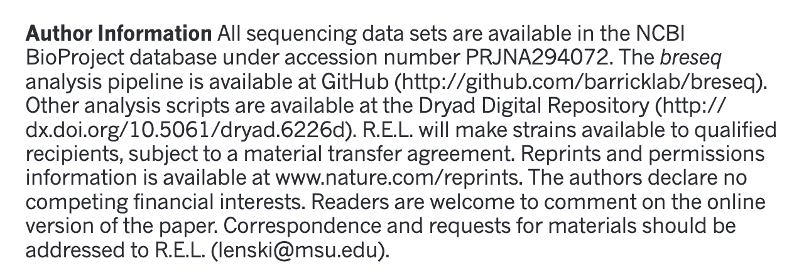

In our experiments we're usually generating our own genomic data, but many types of analyses use reference data or you may want to use it to compare your results or annotate your data with publicly available data. You may also want to do a full project or set of analyses using publicly available data. This data is a great, and essential, resource for genomic data analysis.

There are many repositories for public data. Some model organisms or fields have specific databases, and there are ones for particular types of data. Two of the most comprehensive public repositories are provided by the [National Center for Biotechnology Information  (NCBI)](https://www.ncbi.nlm.nih.gov) and the [European Nucleotide Archive (EMBL-EBI)](https://www.ebi.ac.uk/). The NCBI's [Sequence Read Archive (SRA)](https://trace.ncbi.nlm.nih.gov/Traces/sra/) is the database we will be using for this lesson, but the EMBL-EBI's Nucleic Acid Archive (ENA) is also useful. The general processes are similar for any database.

# Accessing the original archived data

The [sequencing dataset (from Tenaillon, *et al.* 2016) adapted for this lesson](http://www.datacarpentry.org/organization-genomics/data/) was obtained from the [NCBI Sequence Read Archive](http://www.ncbi.nlm.nih.gov/sra) which is a large (~27 petabasepairs/2.7 x 10^16 basepairs as of April 2019) repository for next-generation sequence data. Like many NCBI databases, it is complex and mastering its use is greater than the scope of this lesson. Very often there will be a direct link (perhaps in the supplemental information) to where the SRA dataset can be found. We are only using a small part of these data, so a direct link cannot be found. If you have time, go through the following detailed description of finding the data we are using today (otherwise skip to the next section). 

## Locate the Run Selector Table for the Lenski Dataset on the SRA

See the figures below for how information about data access is provided within the original paper. 

The **above image** shows the title of the study, as well as the authors.

The **image below** shows an excerpt from the paper that includes information on how to locate the sequence data. In this case, the text appears just before the reference section.

**At the beginning of this workshop we gave you [experimental information about these data](http://www.datacarpentry.org/organization-genomics/data/). This lesson uses a *subset* of SRA files, from a small *subproject* of the BioProject database 
"PRJNA294072". To find these data you can follow the instructions below:** 

1. Notice that the paper references "PRJNA294072" as a "BioProject" at NCBI. If you go to the [NCBI website](https://www.ncbi.nlm.nih.gov/) and search for "PRJNA294072" you will be shown a link to the "Long-Term Evolution Experiment with E. coli" BioProject. Here is the link to that database: [https://www.ncbi.nlm.nih.gov/bioproject/?term=PRJNA294072](https://www.ncbi.nlm.nih.gov/bioproject/?term=PRJNA294072). 

2. Once on the BioProject page, scroll down to the table under **"This project encompasses the 
following 13 sub-projects:"**. 

3. In this table, select **subproject** 
*"[PRJNA295606](https://www.ncbi.nlm.nih.gov/bioproject/295606)	SRA or Trace	Escherichia coli B str. REL606	E. coli genome evolution over 50,000 generations (The University of Texas at...)"*. 

4. This will take you to a page with the subproject description, and a table **"Project Data"** 
that 
has a link to the 224 SRA files for this subproject. 

5. Click on the number 
["224"](https://www.ncbi.nlm.nih.gov/sra?linkname=bioproject_sra_all&from_uid=295606) and it will take you to the SRA page for this subproject. 

6. For a more organized table, select "Send results to Run selector" at the top of this page. This 
takes you to the Run Selector page SRP064605 used in the next section. 

## Download the Lenski SRA data from the SRA Run Selector Table

1. Access the Tenaillon dataset from the provided link: [https://trace.ncbi.nlm.nih.gov/Traces/study/?acc=SRP064605](https://trace.ncbi.nlm.nih.gov/Traces/study/?acc=SRP064605).  
You will be presented with a page for the overall SRA accession SRP064605 - this is a collection of all the experimental data.

2. Click on the Run Number of the first entry ([REL4541B](https://trace.ncbi.nlm.nih.gov/Traces/sra/?run=SRR2591054)). This will take you to a page that is a run browser. Take a few minutes to examine some of the descriptions on the page.

3. Go back to the ['previous page'](https://trace.ncbi.nlm.nih.gov/Traces/study/?acc=SRP064605). At the top of the page and in the **Total** row you will see there are 312 runs, 109.43 Gb data, and 168.81 Gbases of data. Click the 'RunInfo Table' button and save the file locally.

We are not downloading any actual sequence data here! This is only a text file that fully describes the entire
dataset.  

You should now have a file called `SraRunTable.txt`

## Review the SraRunTable in a spreadsheet program

Using your choice of spreadsheet program open the `SraRunTable.txt` file. If prompted this is a tab-delimited file (`.tsv`).

> ## Discussion  
> Discuss with the person next to you:
>
> 1. What strain of *E. coli* was used in this experiment?
> 2. What was the sequencing platform used for this experiment?
> 3. What samples in the experiment contain
> [paired end](http://www.illumina.com/technology/next-generation-sequencing/paired-end-sequencing_assay.html)
> sequencing data?
> 4. What other kind of data is available?
> 5. Why are you collecting this kind of information about your sequencing runs?
>
> > ## Solution
> > 1. Escherichia coli B str. REL606 shown under the "organism" column. This is a tricky question because the column labeled "strain" actually has sample names
> > 2. The Illumina sequencing platform was used shown in the column "Platform". But notice they used multiple instrument types listed under "Instrument"
> > 3. Sort by LibraryLayout and the column "DATASTORE_filetype" shows that "minhash_sig realign ref_stats sra wgmlst_sig" were used for all single-end reads. (Also notice the Illumina Genome Analyzer IIx was never used for paired-end sequencing)
> > 4. There are several columns including: megabases of sequence per sample, Assay type, BioSample Model, and more.
> > 5. These are examples of "metadata" that you should collect for sequencing projects that are sent to public databases. 
> >
> {: .solution}
{: .challenge}

After answering the questions, you should avoid saving any changes you might have made to this file. We don't want to make any changes. If you were to save this file, make sure you save it as a plain `.txt` file.

## Downloading a few sequencing files: EMBL-EBI 

The SRA does not support direct download of fastq files from its webpage. However, the [European Nucleotide Archive](https://www.ebi.ac.uk/ena) does. Let's see how we can get a download link to a file we are interested in. 

1. Navigate to the [ENA](https://www.ebi.ac.uk/ena).

2. In the search bar, type in `SRR2589044`. Make sure there are no spaces after the accession number, and press search.

3. You will see a table with information about the sample. In the table, there is a header "FASTQ files (FTP)". If you wanted to download the files to your computer, you could click on the links to download the files. Alternatively, right click and copy the URL to save it for later. We don't need to download these files right now, and because they are large we won't put them on our computers now.

We don't recommend downloading large numbers of sequencing files this way. For that, the NCBI has made a software package called the `sra-toolkit`. However, for a couple files, it's often easier to go through the ENA. 

## Where to learn more

#### About the Sequence Read Archive

* You can learn more about the SRA by reading the [SRA Documentation](http://www.ncbi.nlm.nih.gov/Traces/sra/)  
* The best way to transfer a large SRA dataset is by using the [SRA Toolkit](http://www.ncbi.nlm.nih.gov/Traces/sra/?view=toolkit_doc)  

#### References

Tenaillon O, Barrick JE, Ribeck N, Deatherage DE, Blanchard JL, Dasgupta A, Wu GC, Wielgoss S, Cruveiller S, Médigue C, Schneider D, Lenski RE.
Tempo and mode of genome evolution in a 50,000-generation experiment (2016) Nature. 536(7615): 165–170.  
[Paper](https://www.ncbi.nlm.nih.gov/pmc/articles/PMC4988878/), [Supplemental materials](https://www.ncbi.nlm.nih.gov/pmc/articles/PMC4988878/#)  
Data on NCBI SRA: [https://trace.ncbi.nlm.nih.gov/Traces/sra/?study=SRP064605](https://trace.ncbi.nlm.nih.gov/Traces/sra/?study=SRP064605)  
Data on EMBL-EBI ENA: [https://www.ebi.ac.uk/ena/data/view/PRJNA295606](https://www.ebi.ac.uk/ena/data/view/PRJNA295606)
